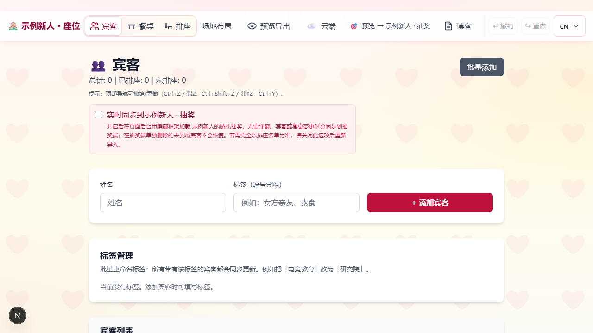
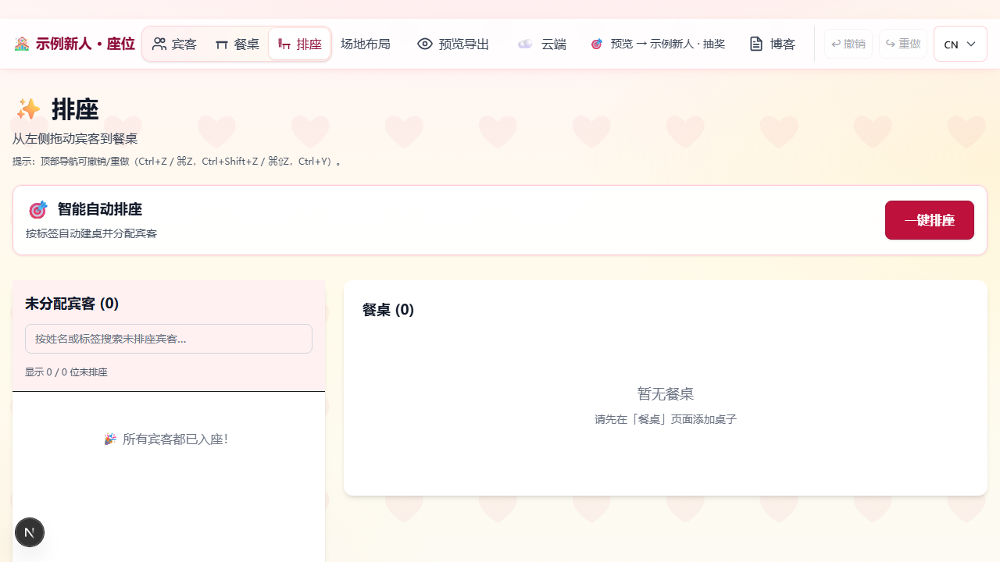
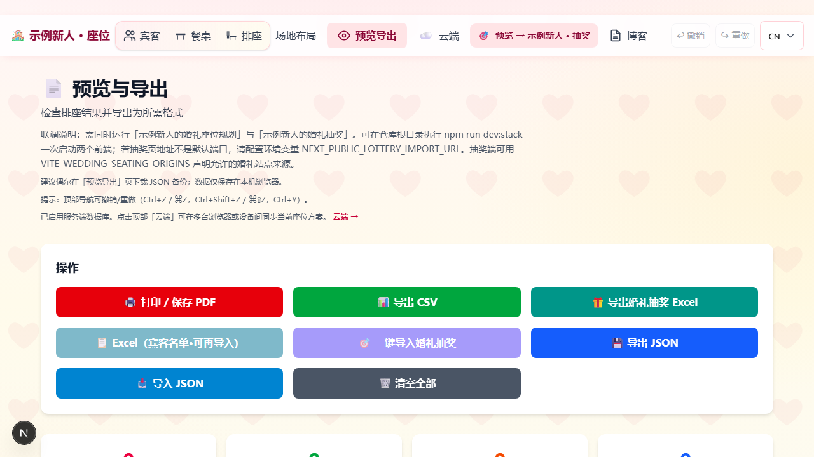
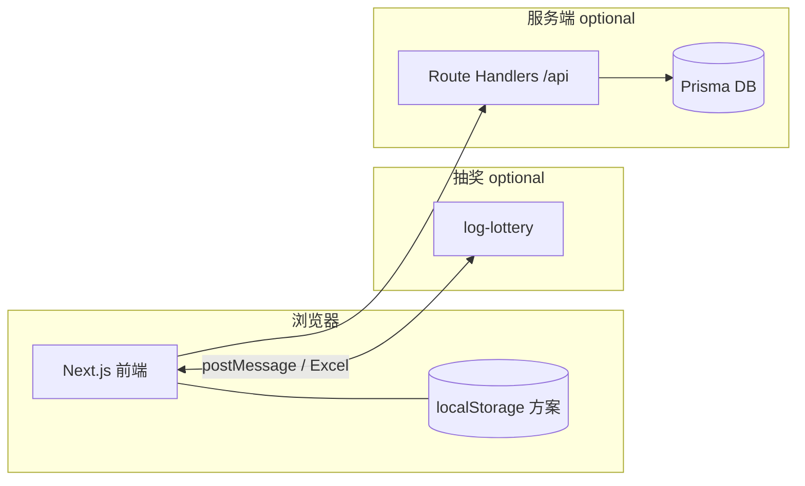
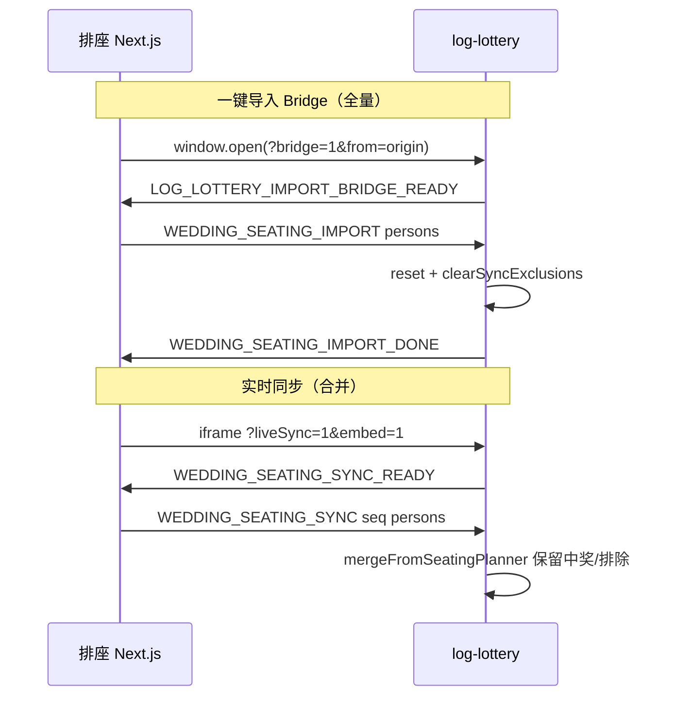

# 💒 WeddingSeats — 婚礼排座与抽奖整合

[](LICENSE)
[](package.json)
[](https://nextjs.org/)

面向婚礼场景的 **座位编排** 与 **抽奖（log-lottery）** 一体化工具链。本仓库是 **整合层（缝合工）**：在两位优秀开源作者的作品之上，做婚礼现场的导出、导入、实时同步与可选云端备份。

**English:** Integration fork — **wedding seating planner** + **log-lottery** with Excel export, `postMessage` bridge, and optional live sync. Local-first; optional cloud when you self-host the API.

---

## 致谢 / Acknowledgments

**本仓库的核心能力来自上游开源项目，我们在此向原作者致以诚挚感谢。** 排座界面与拖拽体验、抽奖 3D 与大屏逻辑，均非本仓库从零编写；我们主要维护两者之间的数据格式、桥接协议、现场文档与部署示例。使用或 Fork 本仓库时，请同时了解并支持下列作者。

### 婚礼排座 — [Ajdin Catic](https://github.com/ajdincatic) · [wedding-seats](https://github.com/ajdincatic/wedding-seats)

感谢 **Ajdin** 开源了优雅好用的婚礼排座工具（Next.js、拖拽排桌、多语言、PDF/CSV 导出等）。我们在此基础上扩展了云端同步、宾客 Excel 导入预览，以及与抽奖系统的联动。

| | |
|---|---|
| **官网 / 演示** | [weddingseats.app](https://weddingseats.app) · [Vercel 演示](https://wedding-seating-plan-pearl.vercel.app/) |
| **许可** | MIT |
| **支持原作者** | [Buy Me a Coffee — ajdin70230](https://buymeacoffee.com/ajdin70230) |

排座核心体验相关的 Issue / 功能请求，请优先向 **[ajdincatic/wedding-seats](https://github.com/ajdincatic/wedding-seats)** 反馈。

### 婚礼 / 年会抽奖 — [LOG1997](https://github.com/LOG1997) · [log-lottery](https://github.com/LOG1997/log-lottery)

感谢 **LOG1997** 开源了成熟的 Vue 3 + Three.js 抽奖系统（奖项配置、3D 球体、IndexedDB 名单、现场大屏等）。我们在 `log-lottery/` 内维护与排座对接的补丁（一键导入、实时合并同步、抽奖端删人不被覆盖等）。

| | |
|---|---|
| **仓库** | [github.com/LOG1997/log-lottery](https://github.com/LOG1997/log-lottery) |
| **许可** | MIT · 默认 dev 端口 **6719**，路径 `/log-lottery/` |

抽奖核心（3D、抽奖流程、奖项 UI、音乐管理功能）的 Issue / PR，请优先向 **[LOG1997/log-lottery](https://github.com/LOG1997/log-lottery)** 提交；本仓库生成的内置提示音及排座联动补丁除外。

### 本仓库的定位

我们仅是 **整合与现场定制**，**核心功劳与版权归属上述作者**。完整署名、引用示例、商标说明与第三方许可见 **[ACKNOWLEDGMENTS.md](ACKNOWLEDGMENTS.md)** · [THIRD_PARTY_NOTICES.md](THIRD_PARTY_NOTICES.md)。

**English (short):** Seating from [ajdincatic/wedding-seats](https://github.com/ajdincatic/wedding-seats); lottery from [LOG1997/log-lottery](https://github.com/LOG1997/log-lottery); integration layer here. Please star and support the upstream projects.

---
| 文档 | 说明 |
|------|------|
| [ACKNOWLEDGMENTS.md](ACKNOWLEDGMENTS.md) | **完整致谢**（引用格式、商标、整合范围 — 文首为摘要） |
| [docs/USAGE.md](docs/USAGE.md) | **使用指南**（现场流程、三种联动方式） |
| [docs/PRIVACY-CHECKLIST.md](docs/PRIVACY-CHECKLIST.md) | **开源前隐私检查**（勿提交宾客名单与密钥） |
| [docs/GITHUB-PUBLISH.md](docs/GITHUB-PUBLISH.md) | **首次推送到 GitHub**（remote、log-lottery、CI） |
| [docs/INTEGRATION.md](docs/INTEGRATION.md) | 排座 ↔ 抽奖 `postMessage` 协议 |
| [SECURITY.md](SECURITY.md) | 安全报告、部署与 `/sync` 模型 |
| [CONTRIBUTING.md](CONTRIBUTING.md) | 贡献与 Issue 该发哪个仓库 |
| [ROADMAP.md](ROADMAP.md) | 后续规划 |

**Fork 后请先改：** `src/lib/brand.ts` 与 `log-lottery/src/constant/brand.ts` 中的新人姓名（开源默认为「示例新人」）。

**上游在线演示（排座）：** [weddingseats.app](https://weddingseats.app) · [上游 Vercel 演示](https://wedding-seating-plan-pearl.vercel.app/)

---

## 界面预览

本地开发（`npm run dev:stack`）下的界面示例；开源默认品牌为「示例新人」，Fork 后请改 `brand.ts`。

| 首页 | 宾客管理 |
|:---:|:---:|
|  |  |
| 排座 | 预览与导出 |
|  |  |

**抽奖（log-lottery）主页：**


**截图说明：** 图片仅用于展示本地开发栈的基础界面与空示例数据，不代表线上部署、功能验收或真实宾客名单。发布前请先检查图片中无私人照片、姓名或联系方式；若需更新，请在 `dev:stack` 运行时执行 `npm run screenshots:readme`，并人工确认生成结果后再替换。

---

## 目录

- [致谢 / Acknowledgments](#致谢--acknowledgments)
- [架构速写](#架构速写)
- [界面预览](#界面预览)
- [开源与隐私](#开源与隐私)
- [本地数据、跨浏览器与备份](#本地数据跨浏览器与备份)
- [婚礼或正式发布前自检](#婚礼或正式发布前自检)
- [快速开始](#快速开始)
- [功能概览](#功能概览)
- [与抽奖联动](#与抽奖联动)
- [排座 ↔ 抽奖 逻辑说明](#排座--抽奖-逻辑说明)
- [可选云端 API](#可选云端-api)
- [仓库布局与内置 log-lottery](#仓库布局与内置-log-lottery)
- [环境变量](#环境变量)
- [常用脚本](#常用脚本)
- [构建、校验与 CI](#构建校验与-ci)
- [部署提示](#部署提示)
- [常见问题](#常见问题)
- [品牌化](#品牌化)
- [License](#license)

---

## 开源与隐私

本仓库面向 **公开开源**。上传 GitHub 前请完整阅读 **[docs/PRIVACY-CHECKLIST.md](docs/PRIVACY-CHECKLIST.md)**：

- **勿提交** `.env`、`prisma/dev.db`、含真实宾客的 JSON / Excel / CSV
- **勿提交** 婚礼私人照片、抽奖自定义媒体（`log-lottery/images`、`videos` 等）
- 抽奖端默认不连接上游远程音乐或公共弹幕服务器；当前内置提示音由本仓库生成脚本使用纯合成波形制作，不含录音或采样音乐。用户另行上传的音乐及配置的服务地址，其使用与分发授权仍由使用者自行确认
- 修改 **`src/lib/brand.ts`** 后若界面仍显示旧姓名，执行 `npm run clean:next` 并 **重启** `npm run dev`（旧字符串会留在 `.next` 缓存里）
- 若 Git 历史中曾误提交隐私，需清理历史后再 `push`（见隐私清单）

版权与上游署名见 [LICENSE](LICENSE)、[ACKNOWLEDGMENTS.md](ACKNOWLEDGMENTS.md)、[THIRD_PARTY_NOTICES.md](THIRD_PARTY_NOTICES.md)。

推送前执行：`npm run check:publish` → `npm run verify:stack` → 按 [docs/GITHUB-PUBLISH.md](docs/GITHUB-PUBLISH.md) 操作。

---

## 架构速写



- **默认：** 排桌数据在访客浏览器本地，无需后端即可使用。
- **可选：** `DATABASE_URL` + `/api/*` 实现登录与方案云同步；抽奖仍为独立站点或同域路径下的 `log-lottery`。

---

## 本地数据、跨浏览器与备份

### 排座（本应用）

- 方案保存在当前浏览器的 **`localStorage`** 中（按 **网站 origin** 区分，例如 `http://localhost:3000` 与线上域名各是一份数据）。
- **不同浏览器之间数据不互通**：Chrome 里的名单不会自动出现在 Edge / Firefox / Safari；**手机与电脑也不是同一份**。
- **同一浏览器**内，只要未清除站点数据、未长期使用无痕模式覆盖原配置，一般会持续保留。

### 抽奖（log-lottery）

- 人员名单通常保存在抽奖页使用的 **浏览器本地存储**（如 IndexedDB），同样是 **按浏览器、按访问地址** 隔离；在 A 浏览器导入的名单，**不会自动**出现在 B 浏览器，需在对应环境下 **重新导入**（或使用你们自行实现的同步方式）。

### 如何避免「换浏览器 / 换电脑后什么都没有」

1. **习惯**：排座与抽奖尽量固定 **同一浏览器**、**同一站点地址**（本地开发始终用同一端口与协议）。
2. **备份**：在预览页定期 **导出 JSON**，保存到网盘或 U 盘；需要时在预览页 **导入 JSON** 即可恢复整份方案。
3. **换电脑或必须换浏览器**：先导出 JSON（或导出抽奖用 Excel），在新环境 **导入后再继续**。
4. **多台设备看到同一份排座**：需启用 **云端同步**（见下文「功能概览 → 云端同步（可选）」）：配置数据库、`/sync` 登录后拉取/推送；若不部署服务端，则只能靠 **文件导出 / 导入** 搬家。

**English:** Seating data lives in **per-browser `localStorage`** (not shared across browsers or devices). Lottery lists are typically **per-browser** too. Use **JSON export/import** on the Preview page for backups and migrations; use **`/sync`** only when you host the API and database.

---

## 婚礼或正式发布前自检

建议在活动或上线前 **按实际使用的电脑与浏览器** 走通一遍（可与真实数据脱敏后的测试表）：

| 步骤 | 说明 |
|------|------|
| 1. 排座 | 导入宾客 → 排桌 → 预览检查名单与桌号 |
| 2. 备份 | 预览页 **导出 JSON**，保存到网盘/U 盘；再 **导入 JSON** 试恢复 |
| 3. 抽奖名单 | 预览页导出 **抽奖用 Excel**，在 **婚礼当天同一浏览器** 的抽奖系统内导入；或直接验证一键导入 / 实时同步（若已启用） |
| 4. 抽奖彩排 | 打开抽奖主页面试抽一轮，确认人数与显示正常 |
| 5. 云端同步（若使用） | 另一设备登录 `/sync`，确认拉取与本地一致 |

本地开发可执行 `npm run verify`；含 `log-lottery` 子项目时执行 `npm run verify:stack`。

---

## 快速开始

### 仅排座（无 `log-lottery/` 时）

```bash
npm ci
cp .env.example .env    # Windows: Copy-Item .env.example .env
npm run dev
```

浏览器打开 [http://localhost:3000](http://localhost:3000)。若暂不使用云端同步，`.env` 可保持占位；需要 `/sync` 时再配置数据库与 `JWT_SECRET`（见「环境变量」）。首次启用云端：`npm run db:init`。

### 排座 + 抽奖（推荐）

本 fork 已内置 **`log-lottery/`**。完整本地栈：

```bash
npm ci
npm ci --prefix log-lottery
cp .env.example .env
# 可选: Copy-Item log-lottery/.env.example log-lottery/.env
npm run dev:stack
```

| 服务 | 默认地址 |
|------|----------|
| 排座 | http://localhost:3000 |
| 抽奖 | http://localhost:6719/log-lottery/home |

`dev:stack` 使用 `concurrently` 并行启动 Next.js 与 Vite；抽奖 **strictPort: true**，6719 被占用时会失败而非静默换端口。

**Node：** 根项目与抽奖子项目均要求 **≥ 24**；CI 使用 Node 24。

**上游 log-lottery 说明：** 子目录上游包管理器为 pnpm；本仓库 CI 与文档以 **npm + `log-lottery/package-lock.json`** 为准。

---

## 功能概览

### 排座（根目录 Next.js 应用）

- 宾客拖拽到圆桌 / 长桌，标签与分组
- 按分组智能落座、场地平面预览
- 导出 PDF、CSV、JSON；导出符合抽奖导入列规范的 Excel
- 多语言界面
- 默认 **localStorage**，无需注册即可使用

### 云端同步（可选）

Prisma + SQLite（可换数据库）保存方案副本；`/sync` 支持登录后与本地比对、拉取 / 推送。

- 开发环境默认管理员：**`admin`** / seed 密码 **`88888888`**（未设 `ADMIN_PASSWORD` 时）。生产环境 seed 会拒绝默认或少于 12 字符的密码，必须先设置强 **`ADMIN_PASSWORD`**。
- 详见 `.env.example` 与 `npm run db:init`；安全模型见 [SECURITY.md](SECURITY.md)

---

## 与抽奖联动

在存在 **`log-lottery/`** 的前提下，排座侧支持：

| 方式 | 说明 |
|------|------|
| **导出 Excel** | 列含 `uid`, `plannerGuestId`, `name`, `department`, `identity`；在抽奖端文件导入（全量替换） |
| **预览页一键导入** | `postMessage` bridge 弹窗；`/preview?lottery=1` 可自动触发 |
| **宾客页实时同步** | 隐藏 iframe 合并推送；抽奖端单独删除的未到场宾客 **不会恢复** |

生产环境请将 **`NEXT_PUBLIC_LOTTERY_IMPORT_URL`** 设为线上抽奖「人员名单」页完整 URL；抽奖端配置 **`VITE_WEDDING_SEATING_ORIGINS`** 含排座 HTTPS origin（与默认值 **合并**）。详见 [docs/INTEGRATION.md](docs/INTEGRATION.md)。

---

## 排座 ↔ 抽奖 逻辑说明



| 概念 | 行为 |
|------|------|
| **数据隔离** | 排座 `localStorage` 与抽奖 IndexedDB **不共享**；需 Excel / bridge / sync 传递 |
| **Bridge** | **全量替换**；清空抽奖端「同步排除列表」；READY 时重新读取最新宾客快照 |
| **Live sync** | **合并**；按 `plannerGuestId` 匹配；保留 `isWin`；抽奖端 `deletePerson` 写入排除键 |
| **Excel 导入** | 与 bridge 一样全量替换，并清空排除列表 |
| **空 payload 保护** | 排座仍有宾客时，异常空 sync **不会** 清空抽奖名单与中奖记录 |
| **IndexedDB 竞态** | 合并/导入后忽略迟到的 DB hydration，避免名单被旧缓存覆盖 |
| **Legacy 去重** | Excel 导入后再 sync 时，按姓名+桌+标签升级旧行并写入 `plannerGuestId` |

现场选型建议：**彩排后期仍改名单** → 实时同步；**定稿后不再改** → 一键导入或 Excel；**不要** 在需要「抽奖端删未到场」的同时又频繁全量 bridge，否则删人记录会被覆盖。

用户向步骤见 [docs/USAGE.md](docs/USAGE.md)；协议字段见 [docs/INTEGRATION.md](docs/INTEGRATION.md)。

---

## 可选云端 API

在未配置 `DATABASE_URL` 时，部分接口仍可返回「数据库未配置」类响应；健康检查会标明状态。启用数据库并迁移 / `db push` 后，`/sync` 与下列路由协同工作：

| 路径 | 作用 |
|------|------|
| [`GET /api/health`](src/app/api/health/route.ts) | 存活探测；若配置数据库则检测连通性 |
| [`POST /api/auth/login`](src/app/api/auth/login/route.ts) | 登录（会话 Cookie） |
| [`POST /api/auth/logout`](src/app/api/auth/logout/route.ts) | 登出 |
| [`GET /api/auth/session`](src/app/api/auth/session/route.ts) | 当前会话 |
| [`GET/PUT /api/plan`](src/app/api/plan/route.ts) | 云端方案读写 |
| [`GET /api/plan/meta`](src/app/api/plan/meta/route.ts) | 方案元信息（如更新时间，供比对） |

---

## 仓库布局与内置 log-lottery

```
.
├── src/                  # 排座 Next.js 应用（含 app/api）
├── prisma/               # 云端同步（可选）
├── log-lottery/          # 已内置的抽奖子项目（vendored 源码 + 本地联动补丁）
├── scripts/
└── .github/workflows/
    └── ci.yml            # CI：按 diff 分别验证 wedding / lottery
```

**抽奖源码已内置：** `log-lottery/` 是普通目录，不是 Git submodule；安装其依赖后即可运行 `npm run dev:stack` 与 `npm run verify:stack`。它基于上游 [LOG1997/log-lottery v0.6.0-5](https://github.com/LOG1997/log-lottery/tree/v0.6.0-5) 的 vendored 快照，并含本仓库的联动补丁；完整署名与授权边界见 [ACKNOWLEDGMENTS.md](ACKNOWLEDGMENTS.md) 和 [THIRD_PARTY_NOTICES.md](THIRD_PARTY_NOTICES.md)。

---

## 环境变量

复制 `.env.example` 为 `.env`。**切勿将含密钥的 `.env` 提交到 Git。**

| 变量 | 说明 |
|------|------|
| `DATABASE_URL` | Prisma 连接串；默认本地 SQLite（路径相对 `prisma/schema.prisma`） |
| `JWT_SECRET` | **生产 `/sync` 必填**（≥32 字符随机串）；本地可省略（开发 fallback） |
| `ADMIN_PASSWORD` | 可选；seed 管理员密码（见 `.env.example`） |
| `NEXT_PUBLIC_LOTTERY_IMPORT_URL` | 抽奖「人员名单」页完整 URL；**修改后需重新 build** |
| `NEXT_PUBLIC_SITE_URL` | 本仓库的公开部署 origin，用于 metadata、sitemap、robots 与结构化数据；未配置时为 `http://localhost:3000` |
| `COOKIE_SECURE` / `COOKIE_INSECURE` | 反向代理 / HTTP 环境下 Cookie 行为（见 `src/lib/auth-session.ts`） |

抽奖端 **`VITE_WEDDING_SEATING_ORIGINS`** 等见 [`log-lottery/.env.example`](log-lottery/.env.example)。

---

## 常用脚本

| 命令 | 作用 |
|------|------|
| `npm run dev` | 仅排座开发 |
| `npm run dev:3001` / `dev:3002` | 排座备用端口（抽奖 origin 白名单已含） |
| `npm run dev:stack` | 排座 + `log-lottery` 并行开发 |
| `npm run clean:next` | 清除 `.next` / `log-lottery/dist`（改 `brand.ts` 后顶栏仍显示旧姓名时用） |
| `npm run db:init` | `prisma db push` + seed |
| `npm run db:studio` | Prisma Studio，浏览本地数据 |
| `npm run verify` | 排座 lint + 单元测试 + build |
| `npm run verify:stack` | 排座 + 内置 `log-lottery` 校验 |
| `npm run verify:ci` / `verify:lottery:ci` | CI 等价校验（见 [`scripts/engine-strict-run.mjs`](scripts/engine-strict-run.mjs)） |
| `npm run screenshots:readme` | 本地 `dev:stack` 运行时抓取 README 截图到 `docs/screenshots/`（需一次性 `npx playwright install chromium`） |

---

## 构建、校验与 CI

```bash
npm run build
npm start
```

合并前建议本地执行 `npm run verify`；含抽奖改动时执行 `npm run verify:stack`。GitHub Actions 工作流见 [`.github/workflows/ci.yml`](.github/workflows/ci.yml)：按 diff 路径决定跑排座或 `log-lottery` 的 verify，门禁合并二者结果。

---

## 部署提示

- **仅排座前端形态：** 无云端同步时可不配置数据库与 `JWT_SECRET`。
- **启用 `/sync` 与 API：** 使用可持久化的数据库（多数 Serverless 环境不适合文件型 SQLite，请改用托管数据库），并设置强随机 **`JWT_SECRET`**；部署后可用 **`GET /api/health`** 确认数据库状态。
- **与线上抽奖联调：** 将 **`NEXT_PUBLIC_LOTTERY_IMPORT_URL`** 设为生产环境「人员名单」URL；线上务必 **HTTPS**，并与抽奖站点 **同源策略 / 部署路径**（`/log-lottery/`）一致。
- **公开部署与搜索：** 设置自己拥有的 HTTPS **`NEXT_PUBLIC_SITE_URL`** 后重新 build；未设置时项目不会把 sitemap、canonical 或结构化数据指向上游域名。

---

## 常见问题

| 现象 | 建议 |
|------|------|
| 一键导入 / 实时同步无反应 | 确认抽奖已启动；`NEXT_PUBLIC_LOTTERY_IMPORT_URL` 的 **origin** 与实际抽奖页一致；抽奖端 `VITE_WEDDING_SEATING_ORIGINS` 含排座 origin |
| 一键导入 25 s 超时 | 弹窗被拦、抽奖未 READY、或零个有效姓名；允许弹窗或改用 Excel |
| 实时同步开启后首包仍空 | 刷新宾客页重开同步；或 `localStorage.setItem('logLottery:liveSyncDebug','1')` 看抽奖端日志 |
| 抽奖删的人又回来了 | 是否用了 bridge/Excel **全量覆盖**；实时同步合并版才会记住抽奖端删除 |
| 同一个人在抽奖出现两次 | 先 Excel（无 `plannerGuestId`）再 sync；改用含该列导出或 bridge 全量导入 |
| 本地抽奖连不上 | 默认端口 **6719**；`strictPort` 下占用即启动失败 |
| `/sync` 或登录报错 | 检查 `DATABASE_URL`、`JWT_SECRET`；首次 `npm run db:init` |
| 登录 HTTP 429 | 失败次数过多被限流，等待 `Retry-After` |
| 改 env 后联动仍不对 | `NEXT_PUBLIC_*` / `VITE_*` 需 **npm run build** 后部署，非仅 restart |
| CI 中 lottery 失败 | 确认 `log-lottery/package-lock.json` 存在且与子项目依赖一致 |
| `next build` lockfile / swc 警告（Windows） | 若最终 **Compiled successfully**，可忽略；或重装 `node_modules` |
| 换浏览器后排座空了 | 用预览页 **导入 JSON 备份** |

---

## 品牌化

新人姓名与展示文案在 **`src/lib/brand.ts`**。Fork 或自用发布前请改为自己的信息。

---

## License

[MIT](LICENSE) — 整合层代码。上游项目各自遵循其仓库中的许可证；再分发时请保留文首 **[致谢](#致谢--acknowledgments)** 与 [ACKNOWLEDGMENTS.md](ACKNOWLEDGMENTS.md) 中的署名。
