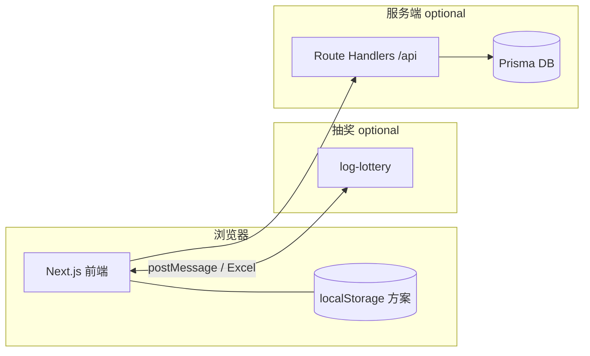

# 💒 WeddingSeats — 婚礼排座与抽奖整合

[](LICENSE)
[](package.json)
[](https://nextjs.org/)

面向婚礼场景的 **座位编排** 与 **抽奖（log-lottery）** 一体化工具链。本仓库是 **整合层（缝合工）**：排座 UI 衍生自 [ajdincatic/wedding-seats](https://github.com/ajdincatic/wedding-seats)，抽奖对接 [LOG1997/log-lottery](https://github.com/LOG1997/log-lottery)；我们主要维护两者之间的导出列、一键导入、实时同步与可选云端备份。

**English:** Integration fork — **wedding seating planner** + **log-lottery** with Excel export, `postMessage` bridge, and optional live sync. Local-first; optional cloud when you self-host the API.

| 文档 | 说明 |
|------|------|
| [docs/USAGE.md](docs/USAGE.md) | **使用指南**（现场流程、三种联动方式） |
| [ACKNOWLEDGMENTS.md](ACKNOWLEDGMENTS.md) | **致谢**（上游作者、仓库链接、如何引用） |
| [docs/PRIVACY-CHECKLIST.md](docs/PRIVACY-CHECKLIST.md) | **开源前隐私检查**（勿提交宾客名单与密钥） |
| [docs/GITHUB-PUBLISH.md](docs/GITHUB-PUBLISH.md) | **首次推送到 GitHub**（remote、log-lottery、CI） |
| [docs/INTEGRATION.md](docs/INTEGRATION.md) | 排座 ↔ 抽奖 `postMessage` 协议 |
| [CONTRIBUTING.md](CONTRIBUTING.md) | 贡献与 Issue 该发哪个仓库 |
| [ROADMAP.md](ROADMAP.md) | 后续规划 |

**Fork 后请先改：** `src/lib/brand.ts` 与 `log-lottery/src/constant/brand.ts` 中的新人姓名（开源默认为「示例新人」）。

**上游在线演示（排座）：** [weddingseats.app](https://weddingseats.app) · [上游 Vercel 演示](https://wedding-seating-plan-pearl.vercel.app/)

---

## 目录

- [架构速写](#架构速写)
- [开源与隐私](#开源与隐私)
- [本地数据、跨浏览器与备份](#本地数据跨浏览器与备份)
- [婚礼或正式发布前自检](#婚礼或正式发布前自检)
- [快速开始](#快速开始)
- [功能概览](#功能概览)
- [与抽奖联动](#与抽奖联动)
- [可选云端 API](#可选云端-api)
- [仓库布局与获取 log-lottery](#仓库布局与获取-log-lottery)
- [环境变量](#环境变量)
- [常用脚本](#常用脚本)
- [构建、校验与 CI](#构建校验与-ci)
- [部署提示](#部署提示)
- [常见问题](#常见问题)
- [品牌化](#品牌化)
- [致谢与开源上游](#致谢与开源上游)
- [License](#license)

---

## 开源与隐私

本仓库面向 **公开开源**。上传 GitHub 前请完整阅读 **[docs/PRIVACY-CHECKLIST.md](docs/PRIVACY-CHECKLIST.md)**：

- **勿提交** `.env`、`prisma/dev.db`、含真实宾客的 JSON / Excel / CSV
- **勿提交** 婚礼私人照片、抽奖自定义媒体（`log-lottery/images`、`videos` 等）
- 修改 **`src/lib/brand.ts`** 后若界面仍显示旧姓名，执行 `npm run clean:next` 并 **重启** `npm run dev`（旧字符串会留在 `.next` 缓存里）
- 若 Git 历史中曾误提交隐私，需清理历史后再 `push`（见隐私清单）

版权与上游署名见 [LICENSE](LICENSE)、[ACKNOWLEDGMENTS.md](ACKNOWLEDGMENTS.md)、[THIRD_PARTY_NOTICES.md](THIRD_PARTY_NOTICES.md)。

推送前执行：`npm run check:publish` → `npm run verify:stack` → 按 [docs/GITHUB-PUBLISH.md](docs/GITHUB-PUBLISH.md) 操作。

---

## 架构速写



- **默认：** 排桌数据在访客浏览器本地，无需后端即可使用。
- **可选：** `DATABASE_URL` + `/api/*` 实现登录与方案云同步；抽奖仍为独立站点或同域路径下的 `log-lottery`。

---

## 本地数据、跨浏览器与备份

### 排座（本应用）

- 方案保存在当前浏览器的 **`localStorage`** 中（按 **网站 origin** 区分，例如 `http://localhost:3000` 与线上域名各是一份数据）。
- **不同浏览器之间数据不互通**：Chrome 里的名单不会自动出现在 Edge / Firefox / Safari；**手机与电脑也不是同一份**。
- **同一浏览器**内，只要未清除站点数据、未长期使用无痕模式覆盖原配置，一般会持续保留。

### 抽奖（log-lottery）

- 人员名单通常保存在抽奖页使用的 **浏览器本地存储**（如 IndexedDB），同样是 **按浏览器、按访问地址** 隔离；在 A 浏览器导入的名单，**不会自动**出现在 B 浏览器，需在对应环境下 **重新导入**（或使用你们自行实现的同步方式）。

### 如何避免「换浏览器 / 换电脑后什么都没有」

1. **习惯**：排座与抽奖尽量固定 **同一浏览器**、**同一站点地址**（本地开发始终用同一端口与协议）。
2. **备份**：在预览页定期 **导出 JSON**，保存到网盘或 U 盘；需要时在预览页 **导入 JSON** 即可恢复整份方案。
3. **换电脑或必须换浏览器**：先导出 JSON（或导出抽奖用 Excel），在新环境 **导入后再继续**。
4. **多台设备看到同一份排座**：需启用 **云端同步**（见下文「功能概览 → 云端同步（可选）」）：配置数据库、`/sync` 登录后拉取/推送；若不部署服务端，则只能靠 **文件导出 / 导入** 搬家。

**English:** Seating data lives in **per-browser `localStorage`** (not shared across browsers or devices). Lottery lists are typically **per-browser** too. Use **JSON export/import** on the Preview page for backups and migrations; use **`/sync`** only when you host the API and database.

---

## 婚礼或正式发布前自检

建议在活动或上线前 **按实际使用的电脑与浏览器** 走通一遍（可与真实数据脱敏后的测试表）：

| 步骤 | 说明 |
|------|------|
| 1. 排座 | 导入宾客 → 排桌 → 预览检查名单与桌号 |
| 2. 备份 | 预览页 **导出 JSON**，保存到网盘/U 盘；再 **导入 JSON** 试恢复 |
| 3. 抽奖名单 | 预览页导出 **抽奖用 Excel**，在 **婚礼当天同一浏览器** 的抽奖系统内导入；或直接验证一键导入 / 实时同步（若已启用） |
| 4. 抽奖彩排 | 打开抽奖主页面试抽一轮，确认人数与显示正常 |
| 5. 云端同步（若使用） | 另一设备登录 `/sync`，确认拉取与本地一致 |

本地开发可执行 `npm run verify`；含 `log-lottery` 子项目时执行 `npm run verify:stack`。

---

## 快速开始

**仅排座（不克隆抽奖子项目时）：**

```bash
npm install
cp .env.example .env
npm run dev
```

Windows PowerShell 可使用：`Copy-Item .env.example .env`。若暂不使用云端同步，`.env` 可保持示例中的占位；仅当需要 `/sync`、登录与 `/api/plan` 时再配置数据库与密钥（见「环境变量」）。

浏览器打开 [http://localhost:3000](http://localhost:3000)。首次启用云端同步时执行 `npm run db:init`（初始化 Prisma + SQLite，详见 `.env.example`）。

**排座 + 抽奖同时开发：** 请先将 [LOG1997/log-lottery](https://github.com/LOG1997/log-lottery) 放到仓库根目录的 **`log-lottery/`** 下（见下节），然后：

```bash
npm run dev:stack
```

默认抽奖开发服务为 `http://localhost:6719`，与 `NEXT_PUBLIC_LOTTERY_IMPORT_URL` 缺省值一致。

**Node：** 根项目要求 **≥ 20**（见 `package.json`）。上游 `log-lottery` 可能要求更高版本；若 `verify:stack` 在子项目安装阶段报错，请按其仓库 `engines` 升级 Node。

---

## 功能概览

### 排座（根目录 Next.js 应用）

- 宾客拖拽到圆桌 / 长桌，标签与分组
- 按分组智能落座、场地平面预览
- 导出 PDF、CSV、JSON；导出符合抽奖导入列规范的 Excel
- 多语言界面
- 默认 **localStorage**，无需注册即可使用

### 云端同步（可选）

Prisma + SQLite（可换数据库）保存方案副本；`/sync` 支持登录后与本地比对、拉取 / 推送。详见 `.env.example` 与 `npm run db:init`。

---

## 与抽奖联动

在存在 **`log-lottery/`** 的前提下，排座侧支持：

| 方式 | 说明 |
|------|------|
| **导出 Excel** | 列与 `log-lottery` 人员名单模板一致（如 uid、name、department、identity），在抽奖端文件导入 |
| **预览页一键导入** | 使用带 `?lottery=1` 的预览流程，通过 `postMessage` 与「人员名单」页握手（`src/lib/lotteryBridge.ts`） |
| **宾客页实时同步** | 隐藏 iframe 合并推送名单；抽奖端单独删除的未到场宾客 **不会恢复**（见 [docs/USAGE.md](docs/USAGE.md) §4.3） |

生产环境请将 **`NEXT_PUBLIC_LOTTERY_IMPORT_URL`** 设为线上抽奖站点「人员名单」页的完整 URL（origin 需与抽奖部署一致，否则 `postMessage` 会被浏览器拦截）。

---

## 可选云端 API

在未配置 `DATABASE_URL` 时，部分接口仍可返回「数据库未配置」类响应；健康检查会标明状态。启用数据库并迁移 / `db push` 后，`/sync` 与下列路由协同工作：

| 路径 | 作用 |
|------|------|
| [`GET /api/health`](src/app/api/health/route.ts) | 存活探测；若配置数据库则检测连通性 |
| [`POST /api/auth/login`](src/app/api/auth/login/route.ts) | 登录（会话 Cookie） |
| [`POST /api/auth/logout`](src/app/api/auth/logout/route.ts) | 登出 |
| [`GET /api/auth/session`](src/app/api/auth/session/route.ts) | 当前会话 |
| [`GET/PUT /api/plan`](src/app/api/plan/route.ts) | 云端方案读写 |
| [`GET /api/plan/meta`](src/app/api/plan/meta/route.ts) | 方案元信息（如更新时间，供比对） |

---

## 仓库布局与获取 log-lottery

```
.
├── src/                  # 排座 Next.js 应用（含 app/api）
├── prisma/               # 云端同步（可选）
├── log-lottery/          # 抽奖子项目（需自行放入）
├── scripts/
└── .github/workflows/
    └── ci.yml            # CI：按 diff 分别验证 wedding / lottery
```

**获取抽奖代码：** 将 [LOG1997/log-lottery](https://github.com/LOG1997/log-lottery) 克隆为根目录下的 `log-lottery`（或 submodule / 子树）。在其目录内安装依赖；根目录的 `npm run dev:stack`、`npm run verify:stack` 依赖该路径存在。

若暂时没有 `log-lottery`，仍可开发与部署排座本体；仅抽奖相关脚本及 CI 中针对 `log-lottery/*` 的校验会跳过或需在本地补齐子项目。

---

## 环境变量

复制 `.env.example` 为 `.env`。**切勿将含密钥的 `.env` 提交到 Git。**

| 变量 | 说明 |
|------|------|
| `DATABASE_URL` | Prisma 连接串；默认本地 SQLite（路径相对 `prisma/schema.prisma`） |
| `JWT_SECRET` | **生产环境必填**，会话签名用随机长字符串 |
| `ADMIN_PASSWORD` | 可选；配合 seed 的管理员密码（见 `.env.example`） |
| `NEXT_PUBLIC_LOTTERY_IMPORT_URL` | 抽奖「人员名单」页完整 URL；一键导入与 iframe 同步依赖正确的 origin |

---

## 常用脚本

| 命令 | 作用 |
|------|------|
| `npm run dev` | 仅排座开发（Turbopack） |
| `npm run dev:stack` | 排座 + `log-lottery` 并行开发 |
| `npm run clean:next` | 清除 `.next` / `log-lottery/dist`（改 `brand.ts` 后顶栏仍显示旧姓名时用） |
| `npm run db:init` | `prisma db push` + seed |
| `npm run db:studio` | Prisma Studio，浏览本地数据 |
| `npm run verify` | 排座 lint + build |
| `npm run verify:stack` | 排座 + `log-lottery` 校验（需存在子目录） |
| `npm run verify:ci` / `verify:lottery:ci` | CI 等价校验（见 [`scripts/engine-strict-run.mjs`](scripts/engine-strict-run.mjs)） |

---

## 构建、校验与 CI

```bash
npm run build
npm start
```

合并前建议本地执行 `npm run verify`；含抽奖改动时执行 `npm run verify:stack`。GitHub Actions 工作流见 [`.github/workflows/ci.yml`](.github/workflows/ci.yml)：按 diff 路径决定跑排座或 `log-lottery` 的 verify，门禁合并二者结果。

---

## 部署提示

- **仅排座前端形态：** 无云端同步时可不配置数据库与 `JWT_SECRET`。
- **启用 `/sync` 与 API：** 使用可持久化的数据库（多数 Serverless 环境不适合文件型 SQLite，请改用托管数据库），并设置强随机 **`JWT_SECRET`**；部署后可用 **`GET /api/health`** 确认数据库状态。
- **与线上抽奖联调：** 将 **`NEXT_PUBLIC_LOTTERY_IMPORT_URL`** 设为生产环境「人员名单」URL；线上务必 **HTTPS**，并与抽奖站点 **同源策略 / 部署路径**（`/log-lottery/`）一致。

---

## 常见问题

| 现象 | 建议 |
|------|------|
| 一键导入 / 实时同步无反应 | 确认抽奖端已启动且 `NEXT_PUBLIC_LOTTERY_IMPORT_URL` 的 **origin** 与实际打开的抽奖页一致（含协议与端口）。 |
| 本地抽奖连不上 | 默认抽奖 dev 端口为 **6719**；若改过端口或 `base`，同步修改环境变量。 |
| `/sync` 或登录报错 | 检查 `DATABASE_URL`、`JWT_SECRET`；首次部署执行 schema 同步（如 `prisma db push` 或团队约定的 migrate 流程）。 |
| CI 中 lottery 失败 | 确认仓库中包含 **`log-lottery/`** 且 `package-lock.json` 与子项目一致；或本次变更未触及 `log-lottery` 时仅跑排座校验。 |
| `next build` 提示 lockfile / swc / `patching`（常见于 Windows） | 若最终仍显示 **Compiled successfully** / **✓**，构建视为成功；警告来自 Next 尝试自动修补 lockfile。若需消除提示，可尝试删除 `node_modules` 后重新执行 `npm ci` 或 `npm install`（勿随手删 `package-lock.json` 除非你清楚后果）。 |
| 换浏览器后排座空了 | 属正常现象：`localStorage` 不跨浏览器。请用预览页 **导入之前的 JSON 备份**，参见「本地数据、跨浏览器与备份」。 |

---

## 品牌化

新人姓名与展示文案在 **`src/lib/brand.ts`**。Fork 或自用发布前请改为自己的信息。

---

## 致谢与开源上游

**完整致谢（作者 GitHub、官网、如何支持原作者、本仓库整合范围）见 [ACKNOWLEDGMENTS.md](ACKNOWLEDGMENTS.md)。**

摘要：

- **排座：** [ajdincatic/wedding-seats](https://github.com/ajdincatic/wedding-seats) · [weddingseats.app](https://weddingseats.app) · [Buy Me a Coffee](https://buymeacoffee.com/ajdin70230)
- **抽奖：** [LOG1997/log-lottery](https://github.com/LOG1997/log-lottery)（MIT，Vue 3 + Three.js，dev 端口 **6719**）

我们仅是整合与现场定制，**核心功劳归上述作者**。

---

## License

[MIT](LICENSE) — 整合层代码。上游项目各自遵循其仓库中的许可证；再分发时请保留 [ACKNOWLEDGMENTS.md](ACKNOWLEDGMENTS.md) 中的署名。
